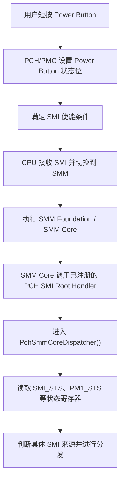
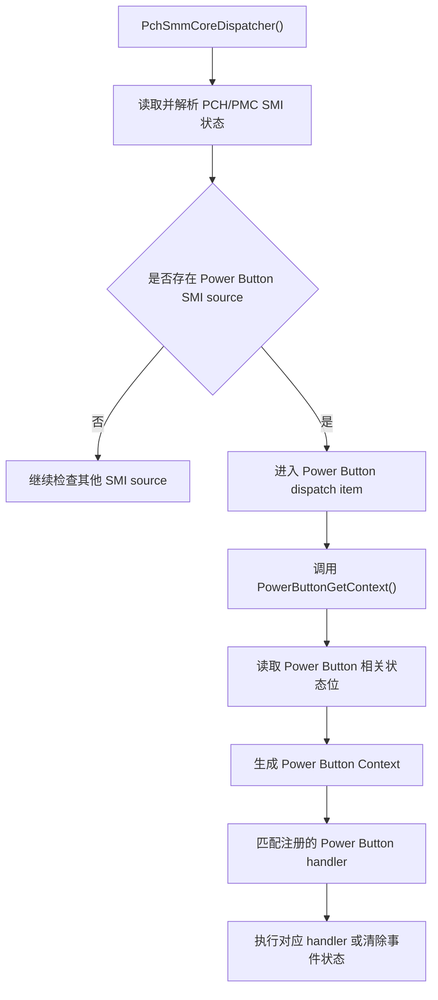
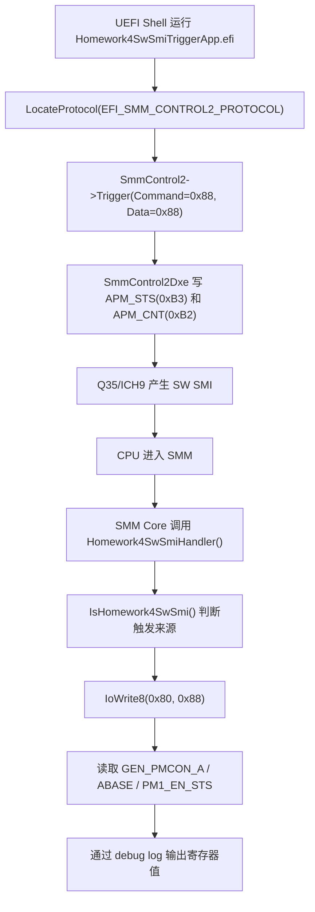

# UEFI SMM 作业四报告

## 1. 作业题目

### 1.1 禁用短按 Power Button 功能流程分析

分析短按 Power Button 相关 SMI 的调度流程，回答以下问题：

1) 程序是怎么进入 `PchSmmCoreDispatcher()` 函数的。

2) 程序是怎么进入 `PowerButtonGetContext()` 函数的。

输出要求为流程图。

### 1.2 编写 SW SMI 模块

在 OVMF/EDK2 环境下编写一个单独的 SW SMI 模块，触发 SMI 后执行以下操作：

1) 在 SMI 中向 `0x80` port 写入 `0x88`。

2) 读取并打印 Q35 平台相关寄存器值，包括 `GEN_PMCON_A`、PMC `ABASE`、`PM1_EN_STS`。

代码编写、文件结构以及代码注释按照 UEFI/EDK2 规范组织，并在 `OvmfPkg` 下进行编写。

---

## 2. 思路

### 2.1 Power Button SMI 调度流程分析

#### 2.1.1 设计依据

Power Button 属于平台电源管理事件。真实平台中，短按 Power Button 后，芯片组电源管理逻辑会设置对应的 PM 状态位，例如 `PWRBTN_STS`，如果对应使能位打开，则会产生 SMI。CPU 收到 SMI 后进入 SMM，执行 SMM Core，再由平台相关的 PCH SMM dispatcher 读取硬件状态并分发给具体的 Power Button handler。

因此，`PchSmmCoreDispatcher()` 不是普通 DXE 代码主动调用进入的，而是在硬件 SMI 触发后，由 SMM Core 进入平台 SMI dispatcher。该函数的作用是统一判断 PCH 侧 SMI 来源，然后根据不同 SMI source 调用对应的 GetContext/handler dispatch 逻辑。

`PowerButtonGetContext()` 的作用是解析 Power Button 事件上下文。Dispatcher 在遍历或匹配 Power Button SMI source 时，需要知道当前事件属于 Power Button entry 还是 exit 阶段，并生成 `EFI_SMM_POWER_BUTTON_REGISTER_CONTEXT` 一类的上下文信息，再把该上下文传给注册的 Power Button handler。

#### 2.1.2 `PchSmmCoreDispatcher()` 进入流程



该流程说明，`PchSmmCoreDispatcher()` 的入口依赖硬件 SMI 事件和 SMM Core 调度机制。它通常作为 PCH SMM 模块注册的核心分发函数存在，不是由 OS 或普通 UEFI application 直接调用。

#### 2.1.3 `PowerButtonGetContext()` 进入流程



`PowerButtonGetContext()` 是 Power Button 分发路径中的上下文获取函数。Dispatcher 只有在识别到当前 SMI 来源属于 Power Button 时才会进入该函数。短按 Power Button 功能要禁用时，核心思路通常是在平台策略或 PCH SMM 层面屏蔽 Power Button SMI 处理，或在事件进入 handler 前清除/忽略短按事件，避免它继续进入默认关机路径。

### 2.2 SW SMI 模块设计

#### 2.2.1 设计依据

本次实验使用的是 OVMF 编译出的 `OVMF_CODE.fd`，运行平台为 QEMU Q35，并且脚本中使用了：

```text
-machine q35,smm=on
```

因此 SW SMI 模块放在 `OvmfPkg` 下更符合当前固件来源。模块类型选择 `DXE_SMM_DRIVER`，并在 `OvmfPkgX64.dsc` 和 `OvmfPkgX64.fdf` 的 `SMM_REQUIRE == TRUE` 分支中加入该模块。这样只有在启用 SMM 的 OVMF 构建中才会包含该 SMM driver，避免影响普通非 SMM 构建。

Q35/ICH9 平台中，APM control port 为 `0xB2`，APM status/data port 为 `0xB3`。OVMF 的 `SmmControl2Dxe` 会使能 `SMI_EN` 中的 `APMC_EN` 和 `GBL_SMI_EN`，然后通过写 `APM_STS/APM_CNT` 产生 SW SMI。为了让触发流程更稳定，本作业没有继续依赖 UEFI Shell 的 `mm` 命令直接写 I/O 端口，而是编写了一个很小的 UEFI application，通过 `EFI_SMM_CONTROL2_PROTOCOL->Trigger()` 触发 SW SMI。

#### 2.2.2 文件结构

```text
OvmfPkg/
  Homework4SwSmiSmm/
    Homework4SwSmiSmm.inf
    Homework4SwSmiSmm.h
    Homework4SwSmiSmm.c

StudyPkg/
  Homework4SwSmiTriggerApp/
    Homework4SwSmiTriggerApp.inf
    Homework4SwSmiTriggerApp.c
```

其中 `Homework4SwSmiSmm` 是真正的 SMM 模块，负责任务要求中的 port 80 写入和寄存器读取；`Homework4SwSmiTriggerApp` 只是测试触发工具，用于在 UEFI Shell 下稳定触发 SW SMI。

#### 2.2.3 模块挂载关系

`Homework4SwSmiSmm.inf` 被加入到：

```text
OvmfPkg/OvmfPkgX64.dsc
OvmfPkg/OvmfPkgX64.fdf
```

位置在 `SMM_REQUIRE == TRUE` 条件分支中。这样编译命令必须带上：

```text
-D SMM_REQUIRE=TRUE
```

否则该 SMM driver 不会进入最终的 OVMF 固件镜像。

`Homework4SwSmiTriggerApp.inf` 被加入到：

```text
StudyPkg/StudyPkg.dsc
```

用于单独编译出 `Homework4SwSmiTriggerApp.efi`，并通过 QEMU 的 FAT 共享目录挂载到 UEFI Shell 中运行。

#### 2.2.4 函数功能与调用关系

`Homework4SwSmiSmmEntryPoint()` 是 SMM driver 入口函数。它通过 `gSmst->SmmLocateProtocol()` 获取 `EFI_SMM_CPU_PROTOCOL`，再通过 `gSmst->SmiHandlerRegister()` 注册 root SMI handler。注册成功后，debug log 中会打印：

```text
Homework4SwSmiSmm: registered SW SMI value 0x88 on APM_CNT 0xB2
```

`Homework4SwSmiHandler()` 是实际 SMI handler。每次 SMI 进入后，它先调用 `IsHomework4SwSmi()` 判断当前 SMI 是否为作业要求的 SW SMI。如果不是目标 SMI，则直接返回；如果是目标 SMI，则执行：

```text
IoWrite8(0x80, 0x88)
DumpHomework4PowerManagementRegisters()
```

`IsHomework4SwSmi()` 用于识别 SW SMI 来源。它优先读取 CPU Save State 中的 I/O 信息，判断是否为向 `ICH9_APM_CNT(0xB2)` 输出 `0x88`；同时保留读取 `ICH9_APM_STS(0xB3)` 的兼容判断，用来适配不同触发路径下的上下文表现。

`DumpHomework4PowerManagementRegisters()` 负责读取并打印寄存器：

1) `GEN_PMCON_A`：通过 `PciRead32(POWER_MGMT_REGISTER_Q35(ICH9_GEN_PMCON_1))` 读取。

2) `ABASE`：通过 `PciRead32(POWER_MGMT_REGISTER_Q35(ICH9_PMBASE)) & ICH9_PMBASE_MASK` 获取 ACPI PM I/O base。

3) `PM1_EN_STS`：通过 `IoRead32(ABase + 0x00)` 读取。

`Homework4SwSmiTriggerApp` 的 `UefiMain()` 用于测试触发。它调用 `gBS->LocateProtocol()` 查找 `EFI_SMM_CONTROL2_PROTOCOL`，然后设置：

```text
CommandPort = 0x88
DataPort    = 0x88
```

最后调用：

```text
SmmControl2->Trigger()
```

完整调用关系如下：



---

## 3. 测试

### 3.1 编译 OVMF 固件

1) 进入 edk2 工作目录：

```bat
cd /d D:\shen_work\Uefi_Project\edk2
```

2) 编译带 SMM 的 OVMF：

```bat
build -p OvmfPkg\OvmfPkgX64.dsc -t VS2022 -b DEBUG -a X64 -D SMM_REQUIRE=TRUE
```

3) 编译成功后确认生成：

```text
Build\OvmfX64\DEBUG_VS2022\FV\OVMF_CODE.fd
Build\OvmfX64\DEBUG_VS2022\FV\OVMF_VARS.fd
```

[OVMF 编译成功并生成 OVMF_CODE.fd、OVMF_VARS.fd 的图片]

### 3.2 编译 SW SMI 触发程序

1) 编译 UEFI Shell 下使用的触发程序：

```bat
build -p StudyPkg\StudyPkg.dsc -t VS2022 -b DEBUG -a X64 -m StudyPkg\Homework4SwSmiTriggerApp\Homework4SwSmiTriggerApp.inf
```

2) 将生成的 `Homework4SwSmiTriggerApp.efi` 复制到共享 FAT 目录：

```powershell
Set-Location D:\shen_work\Uefi_Project\edk2
New-Item -ItemType Directory -Force .\uefi_share
$App = Get-ChildItem .\Build\StudyPkg\DEBUG_VS2022 -Recurse -Filter Homework4SwSmiTriggerApp.efi | Select-Object -First 1
Copy-Item $App.FullName .\uefi_share\Homework4SwSmiTriggerApp.efi -Force
```

[Homework4SwSmiTriggerApp.efi 编译并复制到 uefi_share 的图片]

### 3.3 UEFI Shell 下触发 SW SMI

1) 启动 QEMU，并挂载 FAT 共享目录：

```powershell
powershell -ExecutionPolicy Bypass -File .\run_qemu_uefi_linux.ps1 -EnterSetup -FatDir .\uefi_share
```

2) 在 UEFI Shell 中执行：

```text
map -r
fs0:
ls
Homework4SwSmiTriggerApp.efi
```

3) Shell 中预期输出：

```text
Homework4SwSmiTriggerApp: trigger SW SMI 0x88
Homework4SwSmiTriggerApp: trigger done
```

[UEFI Shell 中运行 Homework4SwSmiTriggerApp.efi 并显示 trigger done 的图片]

### 3.4 Debug Log 验证寄存器读取结果

1) QEMU 退出后，在 PowerShell 中查询 debug log：

```powershell
Select-String -Path .\debug_uefi_linux.log -Pattern "GEN_PMCON_A|PM1_EN_STS|Homework4SwSmiSmm"
```

2) 实际验证结果中可以看到：

```text
Homework4SwSmiSmm: registered SW SMI value 0x88 on APM_CNT 0xB2
Homework4SwSmiSmm: GEN_PMCON_A=0x00000010, ABASE=0x0600, PM1_EN_STS=0x00000000
```

该结果说明 SMM driver 已经注册成功，SW SMI 已经触发，handler 中完成了向 `0x80` port 写 `0x88` 的动作，并读取了 `GEN_PMCON_A`、`ABASE`、`PM1_EN_STS`。

[PowerShell 中 debug_uefi_linux.log 打印 GEN_PMCON_A、ABASE、PM1_EN_STS 的图片]

### 3.5 Power Button 流程图输出

本作业的 Power Button 部分主要是分析 SMM dispatcher 流程。报告中已经给出两张流程图：

1) `PchSmmCoreDispatcher()` 进入流程图。

2) `PowerButtonGetContext()` 进入流程图。

[PchSmmCoreDispatcher 进入流程图的图片]

[PowerButtonGetContext 进入流程图的图片]

---

## 4. 遇到问题

4) 使用 UEFI Shell `mm B2 88 -w 1 -IO` 直接写 I/O 端口时，SMM handler 虽然可能被进入，但无法稳定取得 `0x88` 对应的 SW SMI 上下文，`APM_STS` 也一直显示为 `0x00`。因此最终采用 `EFI_SMM_CONTROL2_PROTOCOL->Trigger()` 触发 SW SMI。该方式会走 OVMF 自身的 `SmmControl2Dxe` 路径，先写 `APM_STS`，再写 `APM_CNT`，触发结果更稳定，也更符合 OVMF 当前实现。

5) SMM 模块必须在 `SMM_REQUIRE=TRUE` 的 OVMF 构建中验证。如果编译时没有加 `-D SMM_REQUIRE=TRUE`，或者 QEMU 没有使用 `q35,smm=on`，SMM driver 无法按预期加载和执行。因此验证时需要同时确认编译参数、QEMU machine 参数以及 `debug_uefi_linux.log` 中的 SMM driver 加载信息。

---

## 5. 导师评价指导

